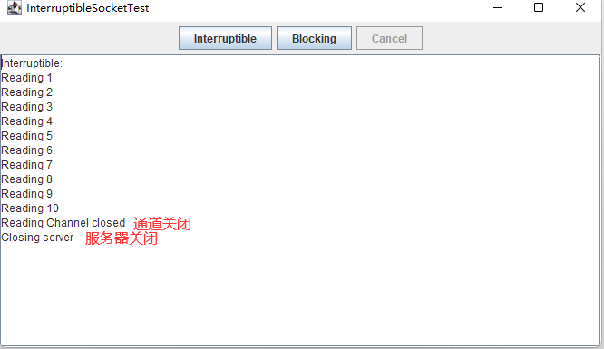
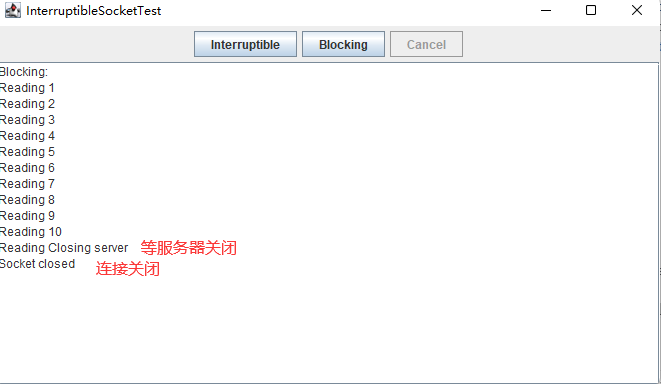

> socket 起源于UNIX，在 Unix 一切皆文件哲学的思想下，socket 是一种"打开—读/写—关闭"模式的实现，服务器和客户端各自维护一个"文件"，在建立连接打开后，可以向自己文件写入内容供对方读取或者读取对方内容，通讯结束时关闭文件。

## 连接服务器

### Telnet 命令

telnet 是一种用于网络编程的非常强大的调试工具。可以使用其来连接远程计算机，或者用于其它网络服务进行通信测试。

>获取当前的UTC时间
```java
telnet time-a.nist.gov 13
```

>响应内容
```bash
59760 22-06-30 09:02:19 50 0 0 946.4 UTC(NIST) * 
```

### Java 连接

在 Java 中，可以使用 Socket（套接字）进行连接到某个地址的端口，并打印响应内容。Socket 负责启动该程序内部与外部之间的通信。

>获取当前的UTC时间
```java
public class SocketTest {
    
    public static void main(String[] args) {
        try (Socket socket = new Socket("time-a.nist.gov", 13);
             Scanner scanner = new Scanner(socket.getInputStream(), "UTF-8")) {
            while (scanner.hasNext()) {
                System.out.println(scanner.nextLine());
            }
        } catch (Exception e) {
            e.printStackTrace();
        }
    }
    
}
```

>程序打印内容
```bash
59760 22-06-30 09:50:51 50 0 0 787.6 UTC(NIST) * 
```

>😊程序说明

1. 打开一个套接字 `Socket socket = new Socket("time-a.nist.gov", 13)`
2. 使用Scanner类接收套接字的 InputStream，方便后续打印在控制台 `Scanner scanner = new Scanner(socket.getInputStream(), "UTF-8")`

Socket 类非常简单易用，因为 Java 库隐藏了建立网络连接和通过连接发送数据的复杂过程。实际上， java.net 包提供的编程接口与操作文件时所使用的接口基本相同。

## 连接超时

使用 Socket 连接主机，在没有响应信息可供读取时，读操作（read()）都将会被阻塞。

### 场景一

如果连接的主机不可访问，那么程序将会阻塞很长时间，受操作系统限制最终导致此次连接超时。

解决办法：通过先构造一个无连接的 Socket，再对这个 Socket 进行设置主机，端口，超时时间等内容。

```java
Socket s = new Socket(); 
s. connect(new InetSocketAddress (host, port) , timeout);
```

### 场景二

基于 Socket 下载文件时，如果文件过大，程序将会处于长时间阻塞状态，这显然是不合理的，可以通过 `setSoTimeout` 方法，设置读取超时时间。

```java
s.setSoTimeout(2000);
```

### IP

网址和 IP 地址之间进行转换，使用 InetAddress 类。

>获取百度IP
```java
InetAddress address = InetAddress.getByName("www.baidu.com");
```

>单个网址，对应多个IP地址。
```java
InetAddress[] address = InetAddress.getAllByName("www.baidu.com");
```

>本地主机IP
```java
InetAddress.getLocalHost().getHostAddress()
```

## 创建服务器

使用ServerSocket类创建服务器套接字，并监听8189端口。

```java
ServerSocket serverSocket = new ServerSocket(8189);
Socket socket = serverSocket.accept();
```

如果有客户端连接到了8189端口，可通过输出/输出流进行内容的交互。

服务器接收客户端内容，使用输入流。

服务器发送内容至客户端，使用输出流。

```java
InputStream inputStream = socket.getInputStream();
OutputStream outputStream = socket.getOutputStream()
```

### 单用户服务器实现

A用户连接到了服务器，B用户则需等到A用户断开连接。

>服务端代码
```java
public class ServerSocketTest {

    public static void main(String[] args) throws IOException {
        try (ServerSocket serverSocket = new ServerSocket(8189);
             Socket socket = serverSocket.accept();
             InputStream inputStream = socket.getInputStream();
             OutputStream outputStream = socket.getOutputStream()) {
            Scanner scanner = new Scanner(inputStream, "UTF-8");
            PrintWriter printWriter = new PrintWriter(new OutputStreamWriter(outputStream, "UTF-8"), true);
            printWriter.println("Hello World! Enable c to exist;");
            boolean done = false;
            while (!done && scanner.hasNext()) {
                String line = scanner.nextLine().trim();
                System.out.println("Echo：" + line);
                if (line.equalsIgnoreCase("c")) {
                    done = true;
                }
            }
        }
    }

}
```

>服务端输出
```java
Echo：c
```

>客户端输出
```java
$ telnet 127.0.0.1 8189

Hello World! Enable c to exist;
c


遗失对主机的连接
```

### 多用户服务实现

在单用户的代码中，`accept()`方法作用是从连接中取出一个客户端的连接。

那么可以通过线程的方式，每次有客户端连接服务器，都启用一个新的线程去处理客户端与服务器之间的交互，而主线程，则立即返回并等到下一个连接。这样就实现了多用户。

>服务端代码
```java
public class ServerSocketTest {

    public static void main(String[] args) throws IOException {
        try (ServerSocket serverSocket = new ServerSocket(8189)) {
            int count = 1;
            while (true) {
                Socket socket = serverSocket.accept();
                System.out.println("count：" + count);
                Thread thread = new Thread(() -> {
                    try (InputStream inputStream = socket.getInputStream();
                         OutputStream outputStream = socket.getOutputStream()) {
                        Scanner scanner = new Scanner(inputStream, "UTF-8");
                        PrintWriter printWriter = new PrintWriter(new OutputStreamWriter(outputStream, "UTF-8"), true);
                        printWriter.println("Hello World! Enable c to exist;");
                        boolean done = false;
                        while (!done && scanner.hasNext()) {
                            String line = scanner.nextLine().trim();
                            System.out.println("Thread Id：" + Thread.currentThread().getId() + " Echo：" + line);
                            if (line.equalsIgnoreCase("c")) {
                                done = true;
                            }
                        }
                    } catch (IOException e) {
                        e.printStackTrace();
                    }
                });
                thread.start();
                count++;
            }
        }
    }
    
}
```

>客户端1号
```shell
$ telnet 127.0.0.1 8189

Hello World! Enable c to exist;
c


遗失对主机的连接。
```

>客户端2号
```shell
$ telnet 127.0.0.1 8189

Hello World! Enable c to exist;
c


遗失对主机的连接。
```

>服务端输出
```shell
count：1
count：2
Thread Id：12 Echo：c
Thread Id：13 Echo：c
```

### 半关闭

半关闭（ half-close ）：Socket 连接的一端可以终止其输出，同时仍旧可以接收来自另一端的数据。

服务器接收客户端传送的数据，服务器使用输入流接收客户端数据，而当数据传输完成后，服务器关闭输出流。此时的服务器输入流还是打开的，客户端仍可以向服务器传送数据。

半连接只适用于一站式（ one-shot ）的服务，例如 HTTP 服务，在这种服务中，客户端连接服务器，发送一个请求，捕获响应信息，然后断开连接

**void shutdownOutput()**

将输出流设为“流结束”

**void shutdownlnput()**

将输入流设为“流结束”

**boolean isOutputShutdown()**

如果输出已被关闭，则返回 true

**boolean isInputShutdown ()**

如果输入已被关闭，则返回 true

## 可中断Socket

客户端，连接到一个Socket时，当前客户端的线程会被阻塞，直到连接建立成功或者超时。

客户端，通过Socket读写数据时候，当前客户端线程也会被阻塞，直到操作成功或者超时。

当客户端因服务端无法响应数据，导致当前线程被阻塞，并且无法通过 interrupt() 方法解除阻塞状态时，需要用到SocketChannel类来解决。

>打开Socket通道 
```shell
SocketChannel channel = SocketChannel.open(new InetSocketAddress (host, port));
```

>Scanner 从 SocketChannel 读取数据
```shell
Scanner in = new Scanner(sock.getInputStream(), "UTF-8");
```

>举个例子
```shell
try (SocketChannel channel = SocketChannel.open(new InetSocketAddress("localhost", 8189)))
{
    in = new Scanner(channel, "UTF-8");
    // 线程中断，不执行while循环，关闭SocketChanel
    while (!Thread.currentThread().isInterrupted())
    {
        messages.append("Reading ");
        if (in.hasNextLine())
        {
            String line = in.nextLine();
            messages.append(line);
            messages.append("\n");
        }
    }
}
```

>完整代码
```java
import javax.swing.*;
import java.awt.*;
import java.io.*;
import java.net.InetSocketAddress;
import java.net.ServerSocket;
import java.net.Socket;
import java.nio.channels.SocketChannel;
import java.util.Scanner;

public class InterruptibleSocketTest {
    public static void main(String[] args) {
        EventQueue.invokeLater(() ->
        {
            JFrame frame = new InterruptibleSocketFrame();
            frame.setTitle("InterruptibleSocketTest");
            frame.setDefaultCloseOperation(JFrame.EXIT_ON_CLOSE);
            frame.setVisible(true);
        });
    }
}

class InterruptibleSocketFrame extends JFrame {
    private Scanner in;
    private JButton interruptibleButton;
    private JButton blockingButton;
    private JButton cancelButton;
    private JTextArea messages;
    private TestServer server;
    private Thread connectThread;

    public InterruptibleSocketFrame() {
        JPanel northPanel = new JPanel();
        add(northPanel, BorderLayout.NORTH);

        final int TEXT_ROWS = 20;
        final int TEXT_COLUMNS = 60;
        messages = new JTextArea(TEXT_ROWS, TEXT_COLUMNS);
        add(new JScrollPane(messages));

        interruptibleButton = new JButton("Interruptible");
        blockingButton = new JButton("Blocking");

        northPanel.add(interruptibleButton);
        northPanel.add(blockingButton);

        interruptibleButton.addActionListener(event ->
        {
            interruptibleButton.setEnabled(false);
            blockingButton.setEnabled(false);
            cancelButton.setEnabled(true);
            connectThread = new Thread(() ->
            {
                try {
                    connectInterruptibly();
                } catch (IOException e) {
                    messages.append("\nInterruptibleSocketTest.connectInterruptibly: " + e);
                }
            });
            connectThread.start();
        });

        blockingButton.addActionListener(event ->
        {
            interruptibleButton.setEnabled(false);
            blockingButton.setEnabled(false);
            cancelButton.setEnabled(true);
            connectThread = new Thread(() ->
            {
                try {
                    connectBlocking();
                } catch (IOException e) {
                    messages.append("\nInterruptibleSocketTest.connectBlocking: " + e);
                }
            });
            connectThread.start();
        });

        cancelButton = new JButton("Cancel");
        cancelButton.setEnabled(false);
        northPanel.add(cancelButton);
        cancelButton.addActionListener(event ->
        {
            connectThread.interrupt();
            cancelButton.setEnabled(false);
        });
        server = new TestServer();
        new Thread(server).start();
        pack();
    }

    /**
     * Connects to the test server, using interruptible I/O
     */
    public void connectInterruptibly() throws IOException {
        messages.append("Interruptible:\n");
        try (SocketChannel channel = SocketChannel.open(new InetSocketAddress("localhost", 8189))) {
            in = new Scanner(channel, "UTF-8");
            while (!Thread.currentThread().isInterrupted()) {
                messages.append("Reading ");
                if (in.hasNextLine()) {
                    String line = in.nextLine();
                    messages.append(line);
                    messages.append("\n");
                }
            }
        } finally {
            EventQueue.invokeLater(() ->
            {
                messages.append("Channel closed\n");
                interruptibleButton.setEnabled(true);
                blockingButton.setEnabled(true);
            });
        }
    }

    /**
     * Connects to the test server, using blocking I/O
     */
    public void connectBlocking() throws IOException {
        messages.append("Blocking:\n");
        try (Socket sock = new Socket("localhost", 8189)) {
            in = new Scanner(sock.getInputStream(), "UTF-8");
            while (!Thread.currentThread().isInterrupted()) {
                messages.append("Reading ");
                if (in.hasNextLine()) {
                    String line = in.nextLine();
                    messages.append(line);
                    messages.append("\n");
                }
            }
        } finally {
            EventQueue.invokeLater(() ->
            {
                messages.append("Socket closed\n");
                interruptibleButton.setEnabled(true);
                blockingButton.setEnabled(true);
            });
        }
    }

    /**
     * A multithreaded server that listens to port 8189 and sends numbers to the client, simulating
     * a hanging server after 10 numbers.
     */
    class TestServer implements Runnable {
        public void run() {
            try (ServerSocket s = new ServerSocket(8189)) {
                while (true) {
                    Socket incoming = s.accept();
                    Runnable r = new TestServerHandler(incoming);
                    Thread t = new Thread(r);
                    t.start();
                }
            } catch (IOException e) {
                messages.append("\nTestServer.run: " + e);
            }
        }
    }

    /**
     * This class handles the client input for one server socket connection.
     */
    class TestServerHandler implements Runnable {
        private Socket incoming;
        private int counter;

        /**
         * Constructs a handler.
         *
         * @param i the incoming socket
         */
        public TestServerHandler(Socket i) {
            incoming = i;
        }

        public void run() {
            try {
                try {
                    OutputStream outStream = incoming.getOutputStream();
                    PrintWriter out = new PrintWriter(
                            new OutputStreamWriter(outStream, "UTF-8"),
                            true /* autoFlush */);
                    while (counter < 100) {
                        counter++;
                        if (counter <= 10) out.println(counter);
                        Thread.sleep(100);
                    }
                } finally {
                    incoming.close();
                    messages.append("Closing server\n");
                }
            } catch (Exception e) {
                messages.append("\nTestServerHandler.run: " + e);
            }
        }
    }
}
```

**结果对比**

|可中断|不可中断|
|--|--|
|客户端第10个数字打印之后，服务器线程进入睡眠，点击 Cancel 按钮，当前客户端线程取消阻塞状态，当前通道关闭，服务器关闭。|客户端第10个数字打印之后，服务器线程进入睡眠，点击 Cancel 按钮，当前客户端线程无法取消阻塞状态，需等服务器关闭连接。|
|||

## URL和URI

统一资源定位符（ Uniform Resource Locator, URL ）和统一资源标识符 (Uniform Resource Identifier, URI）。

URI 是个纯粹的语法结构，包含用来指定 Web 资源的字符串的各种组成部分。URL 是 URI 的一个特例，它包含了用于定位 Web 资源的信息。

其他 URI，比如：mailto:2964556627@qq.com。像这样的 URI，称为：URN (uniform resource name ，统一资源名称）。